# Architecture Overview

This page presents the high-level architecture of the dataset recommender system.

## Dataset RecSys Architecture

```mermaid
%%{init: {'flowchart': {'nodeSpacing': 20, 'rankSpacing': 20}, 'themeVariables': {'fontSize': '12px'}}}%%
flowchart LR

    %% Representation Pipeline
    subgraph Representation[Representation]
        A[Data Ingestion] --> B[Preprocessing]
        B --> C[Embedding Model]
        C --> D[Vector DB]
    end

    %% Retrieval
    subgraph Retrieval[Retrieval]
        D --> F[Candidate Retrieval]
        F --> G[Reranking Module]
    end

    %% Serving
    subgraph Serving[Serving]
        G --> I[Redis Storage]
        I --> J[API Layer]
        J --> K[Client / Platform]
    end

    %% Styling
    classDef update fill:#E3F2FD,stroke:#1E88E5,stroke-width:2px,color:#0D47A1;
    classDef retrieval fill:#FFF3E0,stroke:#FB8C00,stroke-width:2px,color:#E65100;
    classDef serving fill:#F3E5F5,stroke:#8E24AA,stroke-width:2px,color:#4A148C;

    class A,B,C,D update;
    class F,G retrieval;
    class I,J,K serving;
```

## Main Components

### 1. Data Ingestion 
The pipeline starts from dataset profiles fetched from the DataGEMS API.
These profiles include the metadata fields used to represent each dataset.

### 2. Metadata Preprocessing
Before recommendation, the selected metadata fields are cleaned, normalized,
and combined into the textual representation that will be embedded.

### 3. Embedding Model
The embedding model converts each dataset representation into a dense vector
that captures semantic similarity across datasets.

### 4. Vector Database
The generated dataset embeddings are stored in a vector database and reused for recommendation,
so the system does not need to recompute them for every request.

### 5. Candidate Retrieval
The system retrieves candidate datasets using similarity-based search over the
embedding collection.

### 6. Reranking Module (Future Work)
An optional reranking stage can refine the retrieved candidates before the final
top-k recommendation list is produced.

### 7. Redis Storage
Redis stores the final top-k recommendation list for each dataset together with
the associated ranking scores, so results can be served efficiently at request time.

### 8. API Layer
The API exposes the stored recommendations to downstream consumers,
including the DataGEMS platform or other services.

