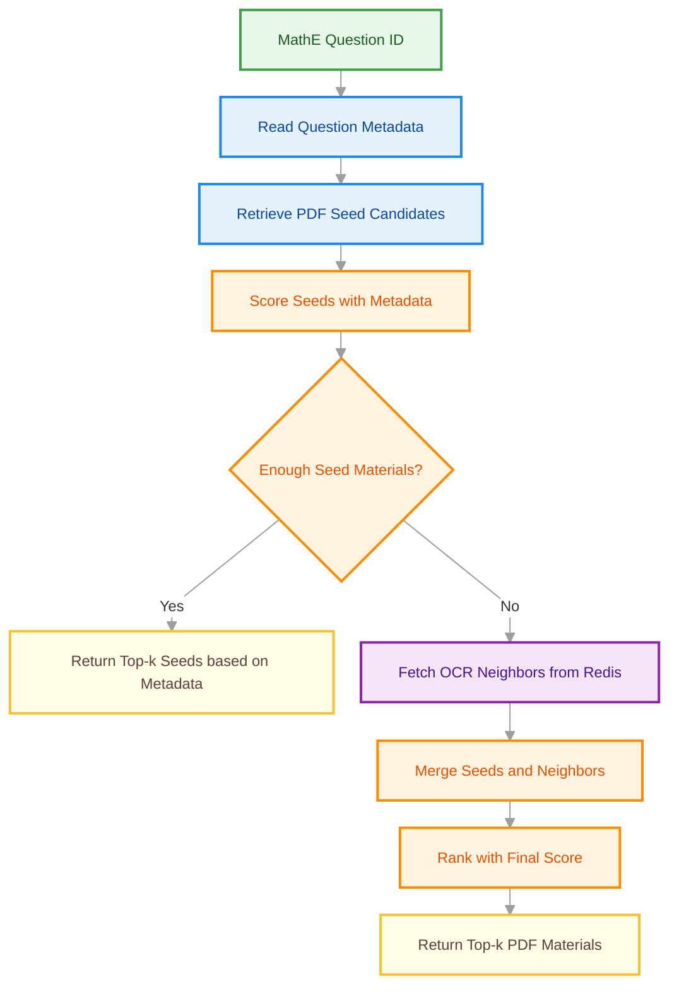

# MathE Material Recommender

Here we describe the MathE educational material recommender. The service
receives a MathE quiz/question ID and returns learning materials that are
aligned with the question metadata.

## Purpose

The purpose of this recommender is to help students better understand and answer quiz questions by recommending relevant educational materials (currently pdfs only), particularly when they answer a question incorrectly.

For each question, the available signals are:

- topic
- subtopic
- keywords

For each PDF material, the available signals are:

- topic
- subtopic
- keywords
- OCR-extracted textual content

## Request-Time Architecture



## Recommendation Logic

```text
Input:
  question_id
  K = number of requested recommendations

Step 1 - Retrieve question metadata
  question_id
  -> topic_id
  -> subtopic_id
  -> keywords

Step 2 - Retrieve PDF seed candidates
  Find PDF materials that match at least one:
    - shared keyword
    - same subtopic
    - same topic

Step 3 - Score seeds using metadata
  For each candidate PDF:

  keyword_jaccard =
    |question_keywords intersection material_keywords|
    /
    |question_keywords union material_keywords|

  same_subtopic =
    1 if question_subtopic is in material_subtopics else 0

  same_topic =
    1 if question_topic is in material_topics else 0

  metadata_score =
    (keyword_jaccard + same_subtopic + same_topic) / 3

Step 4 - If enough seeds exist
  If number_of_seeds >= K:
      return top-K PDFs ranked by metadata_score

Step 5 - If not enough seeds exist
  If number_of_seeds < K:
      keep all seed PDFs
      use them as anchors
      retrieve top-N OCR-neighbor PDFs for each seed PDF

Step 6 - Merge candidates
  final candidate pool =
      seed PDFs
    + OCR-neighbor PDFs

  remove duplicates

Step 7 - Compute embedding score
  For each candidate PDF:

  embedding_score =
      max similarity score with any seed PDF

  Fetch metadata for OCR-neighbor PDFs and compute metadata_score for them
  using the same keyword, subtopic, and topic signals used for seed PDFs.

Step 8 - Final score
  For each candidate:

  final_score =
      lambda * embedding_score
    + (1 - lambda) * metadata_score

Step 9 - Return recommendations
  Return top-K PDFs ranked by final_score DESC
```

## Metadata Score

The metadata score combines three educational alignment signals:

```text
metadata_score =
  (
      keyword_jaccard
    + same_subtopic
    + same_topic
  ) / 3
```

`keyword_jaccard` measures keyword overlap between the question and material:

```text
keyword_jaccard =
  |question_keywords intersection material_keywords|
  /
  |question_keywords union material_keywords|
```

If both keyword sets are empty, `keyword_jaccard` is `0.0`.

The division by `3` keeps `metadata_score` in the `[0, 1]` range, matching the
scale of `embedding_score`.

## OCR Expansion

OCR-neighbor expansion is only used when metadata scoring returns fewer than
the requested number of recommendations.

Redis stores material-to-material OCR-neighbor rankings and similarity scores:

```text
recs:mathe:<seed_material_redis_id>
  -> Redis ZSET of <neighbor_material_redis_id> scored by OCR cosine similarity
```

The Redis material identifier is derived from the PostgreSQL material ID:

```text
platform_materials.id = 221 -> Redis entity ID = 221.pdf
```

The API response still returns the PostgreSQL `platform_materials.id`.
The original `platform_materials.file_name` is display metadata only and is not
used as the Redis lookup key.

If OCR failed for a seed material, Redis has no recommendation key for that
seed. The seed can still be returned because it matched the question metadata,
but it will not contribute OCR-neighbor expansion.

### Future File-Name Alignment

If the sync pipeline is changed so that stored PDFs and Redis keys use
`platform_materials.file_name` instead of `<platform_materials.id>.pdf`, update
the MathE mirror client in one place:

- return `m.file_name AS material_redis_id` instead of `m.id::text || '.pdf'`
- resolve Redis IDs back to DB rows with `m.file_name = ANY(%s)` instead of
  parsing IDs and filtering by `m.id = ANY(%s)`
- keep API responses unchanged: return PostgreSQL `platform_materials.id`

## Embedding Score

Redis stores MathE OCR-neighbor recommendations in sorted sets. The sorted-set
score is the OCR embedding cosine similarity computed during the MathE sync
pipeline.

At request time, the recommender reads Redis with scores and uses the stored
similarity directly:

```text
embedding_score = Redis ZSET score
```

If the same PDF appears as a neighbor of multiple seed PDFs, the recommender
keeps the maximum stored similarity score:

```text
embedding_score = max(similarity from any seed PDF)
```

This is used because a PDF only needs to be highly similar to one strong seed to
be useful. Averaging similarities could unfairly penalize a PDF that is relevant
to one seed but unrelated to others.

## Configuration

The final interpolation weight is controlled by:

```text
MATHE_EMBEDDING_WEIGHT
```

This value is lambda in:

```text
final_score =
    lambda * embedding_score
  + (1 - lambda) * metadata_score
```

Default:

```text
MATHE_EMBEDDING_WEIGHT=0.5
```

The number of Redis OCR neighbors retrieved per seed is controlled by:

```text
MATHE_NEIGHBORS_PER_SEED
```

Default:

```text
MATHE_NEIGHBORS_PER_SEED=20
```

## Implementation Map

The MathE material recommender is implemented across the API, storage, and
scoring layers:

- `dataset_recsys/api/routes/mathe.py`
  - `get_recommendations`
  - `_rank_expanded_candidates`
- `dataset_recsys/storage/mathe_mirror_client.py`
  - `get_question_metadata`
  - `get_pdf_seed_candidates`
  - `get_pdf_material_metadata_by_redis_ids`
  - `get_pdf_material_details`
  - `recommend_pdf_seeds_for_question`
- `dataset_recsys/mathe_seed_scoring.py`
  - `compute_keyword_jaccard`
  - `score_pdf_seed_candidates`
- `dataset_recsys/storage/recommendation_client.py`
  - `get_recommendations`
  - `get_recommendations_with_scores`
