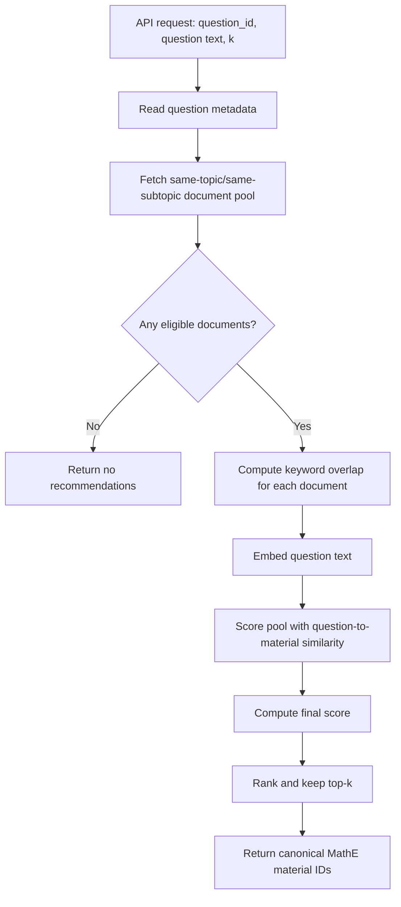

# MathE Material Recommender

This document describes the recommendation approach currently deployed for MathE materials.

The service receives:

- the MathE question ID
- the question text, usually in LaTeX format
- the number of recommendations to return

It returns MathE material IDs, ranked from most to least relevant.

## Current Scope

This page describes the document recommendation endpoint. Supported document
formats are PDF, DOCX, and PPTX. Video lessons and reviews are served separately
by `/dataset-recsys/mathe/recommend/videos` and are never blended into document
recommendations.

The MathE syncer has been extended to discover and process additional material
formats before the embedding/recommendation refresh:

- native PDFs from the mounted MathE material folder
- DOCX files converted to PDF with LibreOffice
- PPTX files converted to PDF with LibreOffice
- YouTube video materials discovered from the MathE platform registry and
  transcribed through an audio pipeline

Processed video transcripts are indexed under `mathe_videos`; document OCR text
is indexed under `mathe_documents`.

The current production system also enforces a hard rule that a recommended
material must have exactly the same topic and subtopic as the question.

## Signals Used

For each question, the recommender uses:

- topic
- subtopic
- keywords
- the question itself

For each material, the recommender uses:

- topic
- subtopic
- keywords
- OCR-extracted text

There are two scores a material gets:

```text
keyword_jaccard
question_to_material_similarity
```

`keyword_jaccard` measures keyword overlap between the question and material.

`question_to_material_similarity` measures similarity between the embedded
question text and the stored material text embedding. 

## Production Flow



## Request-Time Logic, Step By Step

### Step 1 - API Receives The Request

The production API endpoint is in:

```text
dataset_recsys/api/routes/mathe.py
```

The route calls:

```text
recommend_from_curricular_pool(...)
```

from:

```text
dataset_recsys/mathe_recommenders/curricular_pool_ranker.py
```

This is the production recommender path.

### Step 2 - Load Question Metadata

The recommender first loads the MathE metadata for the question:

```text
topic
subtopic
keywords
```

This is done through:

```text
MatheMirrorClient.get_question_metadata(...)
```

in:

```text
dataset_recsys/storage/mathe_mirror_client.py
```

If the question does not exist in the mirror database, the recommender returns
no recommendations.

### Step 3 - Build The Eligible Material Pool

The production recommender then fetches all supported document teaching
materials assigned to the same topic and subtopic as the question.

This is done through:

```text
MatheMirrorClient.get_document_materials_for_question_topic_subtopic(...)
```

in:

```text
dataset_recsys/storage/mathe_mirror_client.py
```

### Step 4 - Compute Keyword Overlap

For every material in the eligible pool, the recommender computes:

```text
keyword_jaccard =
  |question_keywords intersection material_keywords|
  /
  |question_keywords union material_keywords|
```

If both keyword sets are empty, the score is `0.0`.

The helper is:

```text
compute_keyword_jaccard(...)
```

in:

```text
dataset_recsys/mathe_recommenders/seed_scoring.py
```

Inside this production ranker, `metadata_score` is set equal to
`keyword_jaccard`, because topic and subtopic have already been used to define
the pool.

### Step 5 - Embed The Question Text

The question text sent by MathE is embedded at request time.

This is done by:

```text
encode_question(...)
```

in:

```text
dataset_recsys/mathe_recommenders/question_embedding.py
```

The same embedding model is used for MathE material OCR embeddings.

### Step 6 - Score Eligible Materials Against The Question

The recommender scores only the materials already present in the eligible pool.

This is done with:

```text
score_question_similarity_for_material_ids(...)
```

in:

```text
dataset_recsys/mathe_recommenders/question_embedding.py
```

Internally, this calls:

```text
EmbeddingClient.find_similar_by_ids(...)
```

from:

```text
dataset_recsys/storage/embedding_client.py
```

This means the vector query asks:

```text
For these specific eligible material IDs, how similar is each one to the question?
```

It does not perform an open nearest-neighbor search over all materials.

If an eligible material has no stored embedding, it keeps:

```text
question_to_material_similarity = 0.0
```

### Step 7 - Compute Final Score

The final score is computed in:

```text
_rank_candidates(...)
```

inside:

```text
dataset_recsys/mathe_recommenders/curricular_pool_ranker.py
```

The score is:

```text
final_score =
    lambda * keyword_jaccard
  + (1 - lambda) * question_to_material_similarity
```

The default is:

```text
lambda = 0.6
```

So by default:

```text
final_score =
    0.6 * keyword_jaccard
  + 0.4 * question_to_material_similarity
```

The reason for this weighting is that, after the hard topic/subtopic filter,
keyword overlap is the remaining explicit curriculum signal. The question
embedding then refines the order inside the same curricular pool.

### Step 8 - Return MathE Material IDs

Candidates are keyed internally by the canonical MathE platform material ID,
which is also the ID used by the `mathe_documents` embedding collection:

```text
30
31
32
```

The API response returns that same MathE material ID:

```text
30
```

## What Changed From The Previous Hybrid Version

The previous hybrid recommender used three sources:

```text
metadata seed documents
OCR-neighbor documents
question-nearest documents
```

That approach was useful for open discovery, but it could recommend materials
outside the exact question topic/subtopic.

The older hybrid implementation is still kept for comparison and validation:

```text
dataset_recsys/mathe_recommenders/hybrid.py
```

These comparison strategies now query the `mathe_documents` namespace with
canonical MathE platform material IDs as well. They differ from production in
their candidate-generation and ranking strategies, not in their ID format or
content namespace.

## Implementation Map

| Step | File | Function | Role |
| --- | --- | --- | --- |
| API entry point | `dataset_recsys/api/routes/mathe.py` | route handler | Receives the MathE request and calls the production recommender. |
| Production recommender | `dataset_recsys/mathe_recommenders/curricular_pool_ranker.py` | `recommend_from_curricular_pool` | Returns top-k material IDs from the same topic/subtopic document pool. |
| Candidate ranking | `dataset_recsys/mathe_recommenders/curricular_pool_ranker.py` | `rank_curricular_pool_candidates` | Builds the eligible pool, scores it, and ranks candidates. |
| Final scoring | `dataset_recsys/mathe_recommenders/curricular_pool_ranker.py` | `_rank_candidates` | Computes `final_score` and sorts candidates. |
| Question metadata | `dataset_recsys/storage/mathe_mirror_client.py` | `get_question_metadata` | Reads question topic, subtopic, and keywords. |
| Eligible pool | `dataset_recsys/storage/mathe_mirror_client.py` | `get_document_materials_for_question_topic_subtopic` | Fetches supported teaching material documents in the same topic/subtopic as the question. |
| Keyword score | `dataset_recsys/mathe_recommenders/seed_scoring.py` | `compute_keyword_jaccard` | Computes question/material keyword overlap. |
| Question embedding | `dataset_recsys/mathe_recommenders/question_embedding.py` | `encode_question` | Embeds the MathE question text. |
| Question similarity | `dataset_recsys/mathe_recommenders/question_embedding.py` | `score_question_similarity_for_material_ids` | Scores eligible materials against the question embedding. |
| Vector scoring by IDs | `dataset_recsys/storage/embedding_client.py` | `find_similar_by_ids` | Scores only the material IDs already in the eligible pool. |
| Comparison CLI | `dataset_recsys/utils/mathe_recsys_compare_cli.py` | `main` | Runs selected recommender approaches for validation and CSV/JSON export. |

## Configuration

The production curricular pool ranker is controlled by:

```text
MATHE_CURRICULAR_KEYWORD_WEIGHT
MATHE_EMBEDDING_MODEL
```

Current defaults:

```text
MATHE_CURRICULAR_KEYWORD_WEIGHT=0.6
MATHE_EMBEDDING_MODEL=BAAI/bge-m3
```

The question similarity weight is always:

```text
1 - MATHE_CURRICULAR_KEYWORD_WEIGHT
```

The older recommenders are still available for comparison:

```text
dataset_recsys/mathe_recommenders/metadata_ocr.py
dataset_recsys/mathe_recommenders/question_embedding.py
dataset_recsys/mathe_recommenders/hybrid.py
```

They can be compared through:

```text
dataset_recsys/utils/mathe_recsys_compare_cli.py
```
