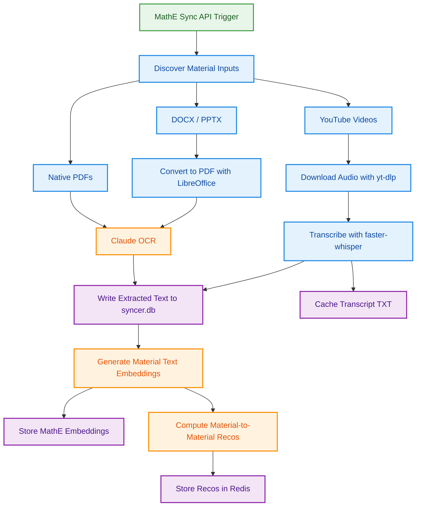

# MathE Workflows

This page describes the workflows that are specific to the MathE use case.

## Sync, Extraction, and Refresh

The MathE sync workflow prepares educational materials before rebuilding the
MathE embedding and Redis recommendation stores.



This workflow is implemented by:

```text
dataset_recsys/utils/mathe_syncer.py
dataset_recsys/workflows/mathe_sync_pipeline.py
```

The syncer can now process YouTube video materials by downloading audio and
transcribing it into text. Transcript entities are normalized as `<video_id>.txt`
when embeddings and Redis recommendations are rebuilt.

At the moment, this broader sync/indexing capability is ahead of the production
MathE question API. The `/dataset-recsys/mathe/recommend` endpoint still builds
its request-time candidate pool from document teaching materials in the same
topic/subtopic as the question. Video materials are not exposed by that endpoint
yet.

## Material Inputs

The syncer can prepare text from several material sources:

- native PDFs under `<MATHE_PATH>/pdfs`
- DOCX files under `<MATHE_PATH>/docxs`
- PPTX files under `<MATHE_PATH>/ppts`
- YouTube videos discovered from the MathE platform registry

DOCX and PPTX materials are converted to temporary PDFs with LibreOffice before
Claude OCR is applied.

For YouTube materials, the syncer accepts either full YouTube URLs or raw
11-character YouTube IDs. It uses `yt-dlp` to download audio, `faster-whisper`
to transcribe speech, and `<MATHE_PATH>/transcripts/<video_id>.txt` as a local
transcript cache.

The MathE platform material types are:

- `1`: Video Lesson
- `2`: Video Review
- `3`: Teaching Material

The syncer discovers video materials from the MathE platform registry with:

```text
SELECT link FROM platform_materials WHERE type IN (1, 2);
```

This selects both video categories and excludes `type = 3` teaching materials.
After fetching links, the syncer still validates each value with YouTube
detection logic. Only values that look like a YouTube URL or an 11-character
YouTube ID are queued for transcription.

During the embedding refresh, raw YouTube IDs are normalized to Redis/vector
entity IDs of the form:

```text
<video_id>.txt
```

## Output State

The syncer writes its local processing catalog to:

```text
<MATHE_PATH>/syncer.db
```

This sqlite file is the syncer's checkpoint. It lets the next sync run know which
materials have already been discovered, which ones still need processing, and
which ones failed.

Each entry stores fields such as:

```text
id
type
source_value
internal_pdf_path
claude_ocr_text
status
```

The exact fields depend on the material type:

- PDFs, DOCX, and PPTX entries use `type: document` and usually include
  `internal_pdf_path`, pointing to either the native PDF or the temporary PDF
  produced by LibreOffice.
- YouTube entries use `type: audio`, keep the original platform link in
  `source_value`, and store the transcript text in `claude_ocr_text`.

`status` controls what happens in later runs:

- `pending` means the material has been discovered but not successfully
  processed yet.
- `completed` means usable text exists in `claude_ocr_text`.
- `failed` means OCR or transcription failed and the entry is skipped by the
  current batch processing loop.

Only completed entries with non-empty `claude_ocr_text` are used by the refresh
pipeline. Those texts are embedded, stored in the MathE embedding table, used to
compute material-to-material recommendations, and then written to Redis under
the MathE application namespace.

For videos, the syncer also writes transcript backups to:

```text
<MATHE_PATH>/transcripts/<video_id>.txt
```

These backups let the syncer restore completed transcript text without
downloading and transcribing the same video again.

## Configuration

The syncer depends on the mounted material folder and on credentials for the
external systems it reads from or writes to.

```text
MATHE_PATH
```

`MATHE_PATH` is the root folder for MathE material processing. Under this path,
the syncer expects or creates folders/files such as:

```text
pdfs/
docxs/
ppts/
transcripts/
syncer.db
sync_status.json
cookies.txt
```

The PostgreSQL settings let the syncer read MathE platform material links:

```text
DATAGEMS_POSTGRES_HOST
DATAGEMS_POSTGRES_PORT
DB_DS_NAME
DB_DS_USER
DB_DS_PASSWORD
DATAGEMS_POSTGRES_SCHEMA
```

The AWS settings are used by the Claude/Bedrock OCR path for document text
extraction:

```text
AWS_ACCESS_KEY
AWS_SECRET_KEY
```

Video transcription depends on:

```text
ffmpeg
yt-dlp
faster-whisper
```

`yt-dlp` downloads the YouTube audio stream, `ffmpeg` extracts/converts the
audio, and `faster-whisper` produces the transcript. The container installs
`ffmpeg`; the Python dependencies are declared in `pyproject.toml`.

If `<MATHE_PATH>/cookies.txt` exists, `yt-dlp` uses it when downloading YouTube
audio. This is useful for videos that need consent/session cookies or are not
downloadable anonymously.
