## Production Workflows

In production, the system components interact through three core operational workflows:
full batch rebuild, incremental dataset update, and recommendation serving.

### 1. Full Batch Rebuild Workflow

```mermaid
%%{init: {'flowchart': {'nodeSpacing': 22, 'rankSpacing': 22}, 'themeVariables': {'fontSize': '12px'}}}%%
flowchart LR
    A[Scheduler / Manual Trigger] --> B[Fetch Full Catalog]
    B --> C[Preprocess Metadata]
    C --> D[Generate Embeddings]
    D --> E[Update Vector DB]
    E --> F[Compute Top-k Recos + Scores]
    F --> G[Write Recos to Redis]

    classDef trigger fill:#E8F5E9,stroke:#43A047,stroke-width:2px,color:#1B5E20;
    classDef prep fill:#E3F2FD,stroke:#1E88E5,stroke-width:2px,color:#0D47A1;
    classDef compute fill:#FFF3E0,stroke:#FB8C00,stroke-width:2px,color:#E65100;
    classDef storage fill:#F3E5F5,stroke:#8E24AA,stroke-width:2px,color:#4A148C;

    class A trigger;
    class B,C prep;
    class D,F compute;
    class E,G storage;
```

This workflow is used when the full catalog must be recomputed, for example
after an embedding-model change, a major metadata update, or an initial deployment.

### 2. Incremental Dataset Update Workflow

This workflow updates only the changed dataset: it updates its embedding,
computes its recommendation list, and writes the new top-k output to Redis.

Optionally, the system can also perform a **selective neighbor refresh**:
- retrieve the top-M nearest existing datasets to the changed dataset
- recompute their recommendation lists
- update their corresponding Redis entries

This allows the new or updated dataset to appear in relevant existing recommendation
lists without requiring a full catalog rebuild. A broader rebuild can still be done later,
if needed.

### 3. Recommendation Serving with Access Control

This is the request-time path. The recommendation computations are
performed ahead of time, while the API authenticates the requester and filters
out datasets the user is not authorized to access.
